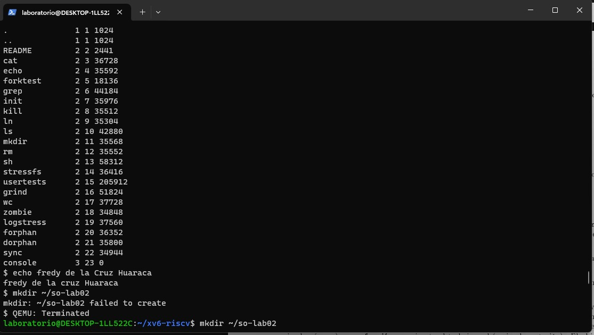
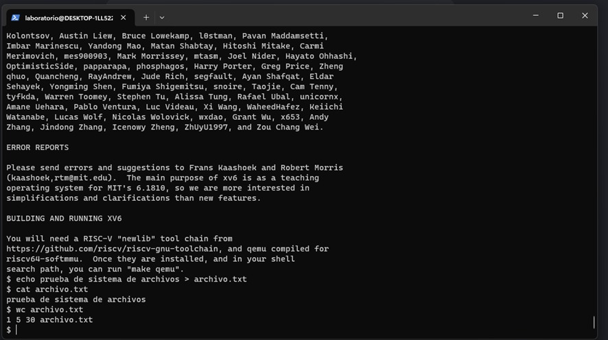
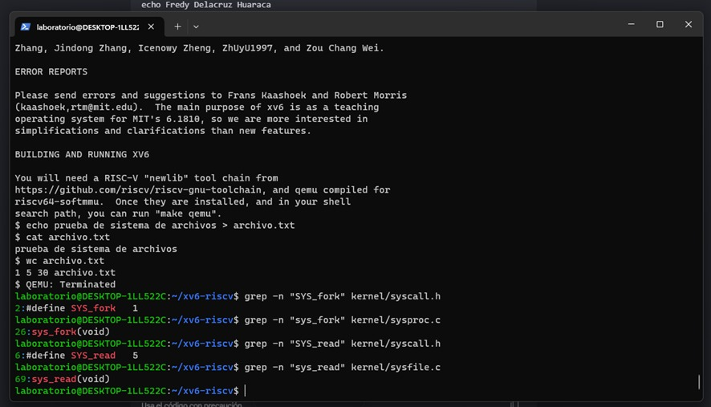

# Laboratorio 02 - Instalación de xv6

**Estudiante:** Fredy Delacruz Huaraca  
**Curso:** Sistemas Operativos (IS-380)

## 1. Comandos Ejecutados en la Parte A
A continuación, se adjunta la evidencia del correcto arranque de xv6 y 
la ejecución de los comandos secuenciales solicitados (`ls`, `echo`, `mkdir`, `cat`, redirección y `wc`):

## 2. Resultados de las Búsquedas Grep (Parte C)
Se localizaron los identificadores y los puntos de entrada de la implementación 
para las llamadas al sistema requeridas en la guía:

* **Llamada al sistema `fork`:**
  * **Interfaz (ID numérico):** `kernel/syscall.h:2:#define SYS_fork    1`
  * **Implementación:** `kernel/sysproc.c:26:sys_fork(void)`

* **Llamada al sistema `read`:**
  * **Interfaz (ID numérico):** `kernel/syscall.h:6:#define SYS_read    5`
  * **Implementación:** `kernel/sysfile.c:69:sys_read(void)`

